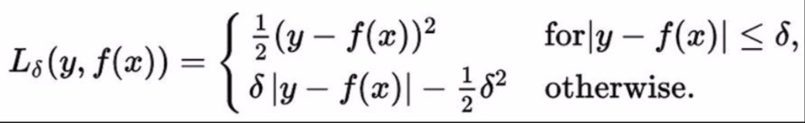

# TF Control Flow

* Control Flow Ops `tf.group, tf.count_up_to, tf.cond, tf.case, tf.while_loop, ...`

* Comparison Ops `tf.equal, tf.not_equal, tf.less, tf.greater, tf.where, ...`

* Logical Ops `tf.logical_and, tf.logical_not, tf.logical_or, tf.logical_xor`

* Dubugging Ops `tf.is_finite, tf.is_inf, tf.is_nan, tf.Assert, tf.Print, ...`

 Since TF builds graph before computation, we have to specify all possible subgraphs beforehand. PyTorch’s dynamic graphs and TF’s eager execution help overcome this

## Example: Huber loss



* Use `tf.cond()`

```python
def huber_loss(labels, predictions, delta=14.0):
    residual = tf.abs(labels - predictions)
    def f1(): return 0.5 * tf.square(residual)
    def f2(): return delta * residual - 0.5 * tf.square(delta)
    return tf.cond(residual < delta, f1, f2)
```

# tf.data

## tf.data.Dataset

* store data in `tf.data.Dataset`
  * `tf.data.Dataset.from_tensor_slices((features, labels))`
    ```python
    dataset = tf.data.Dataset.from_tensor_slices((data[:,0], data[:,1]))
    ```
  * `tf.data.Dataset.from_generator(gen, output_types, output_shapes)`
    ```python
    dataset = tf.data.Dataset.from_tensor_slices((data[:,0], data[:,1]))
    print(dataset.output_types)  # >> (tf.float32, tf.float32)
    print(dataset.output_shapes) # >> (TensorShape([]), TensorShape([]))
    ```
  * Create data from files

    `tf.data.TextLineDataset(filenames)`

    `tf.data.FixedLengthRecordDataset(filenames)`

    `tf.data.TFRecordDataset(filenames)`

## tf.data.Iterator

* `iterator = dataset.make_one_shot_iterator()` Iterates through the dataset exactly once. No need to initialization.

  ```python
  iterator = dataset.make_one_shot_iterator()
  X, Y = iterator.get_next()  # X is the birth rate, Y is the life expectancy
  with tf.Session() as sess:
      print(sess.run([X, Y])) # >> [1.822, 74.82825]
      print(sess.run([X, Y])) # >> [3.869, 70.81949]
      print(sess.run([X, Y])) # >> [3.911, 72.15066]
  ```

* `iterator = dataset.make_initializable_iterator()` Iterates through the dataset as many times as we want. Need to initialize with each epoch.

  ```python
  iterator = dataset.make_initializable_iterator()
  ...
  for i in range(100):
      sess.run(iterator.initializer)
      total_loss = 0
      try:
          while True:
              sess.run([optimizer])
      except tf.errors.OutOfRangeError:
          pass
  ```

## Data Handling in Tensorflow

  ```python
  dataset = dataset.shuffle(1000)

  dataset = dataset.repeat(100)

  dataset = dataset.batch(128)

  dataset = dataset.map(lambda x: tf.one_hot(x, 10))  # convert each elem of dataset to one_hot vector
  ```

# Optimizers

```python
optimizer = tf.train.GradientDescentOptimizer(learning_rate=0.01).minimize(loss)
_, l = sess.run([optimizer, loss], feed_dict={X: x, Y:y})
```

Session looks at all trainable variables that loss depends on and update them

## Trainable Variables

```python
tf.Variable(initial_value=None, trainable=True,...)
```

Specify if a variable should be trained or not By default, all variables are trainable

## List of Optimizers in tf

```python
tf.train.GradientDescentOptimizer

tf.train.AdagradOptimizer

tf.train.MomentumOptimizer

tf.train.AdamOptimizer

tf.train.FtrlOptimizer

tf.train.RMSPropOptimizer
```